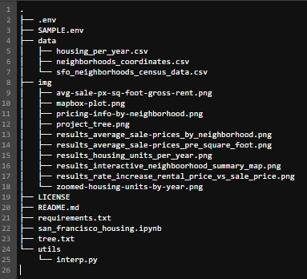
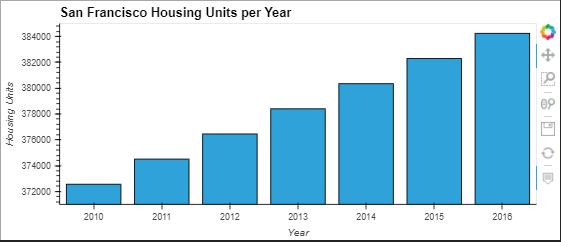
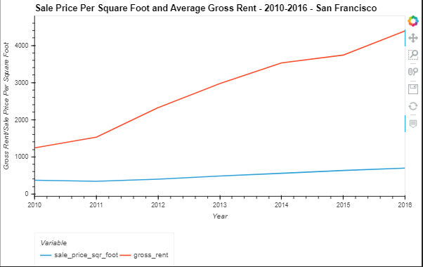
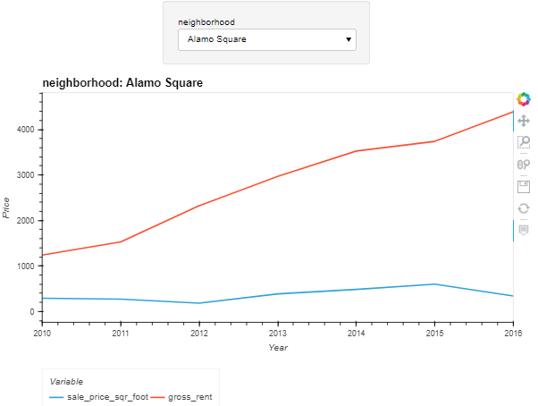
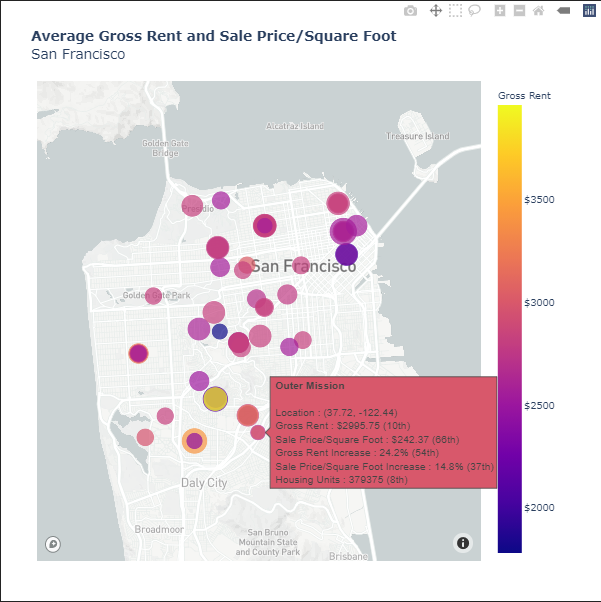
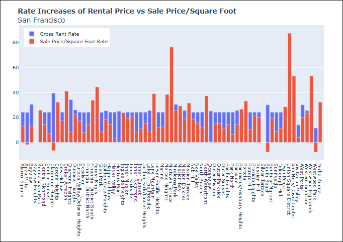

# <a id="Top-of-Page"> Welcome to the San Francisco Housing App!</a>
#### An app for finding the best San Francisco neighborhoods for a one-click property buy-to-rent service.

***
## <a id="Contents">Cotents</a>
[Project Description](#Project-Description) 
[Technologies](#Technologies) 
[Installation Guide](#Installation-Guide) 
[Usage](#Usage) 
[Contributors](#Contributors) 
[License](#License) 
[Bottom of Page](#Bottom-of-Page) 

***
## <a id="Project-Description">Project Description</a>
This trend analysis project provides visualizations of rental property growth opportunities.

#### A summary of what's under the hood:    
This project aims to aggregate, visualize, and geo-display property data by doing the following:
 - Calculate and plot the housing units per year
 - Calculate and plot the average prices per square foot
 - Compare the average prices by neighborhood
 - Build an interactive neighborhood map
 - Compose a summary of the numerical and visual information 
 
#### Project layout:
The layout of essentials for this project is show below.

**Note:** <code>.env</code> is only a reference to show how and where it should be in the project structure. Please use <code>SAMPLE.env</code> as a reference template for your own <code>.env</code> file.

***
## <a id="Technologies">Technologies</a>
<a href="https://docs.python.org/release/3.8.0/" title="https://docs.python.org/release/3.8.0/">

 
<a href="./requirements.txt" title="requirements.txt">Requirements List</a>

***
## <a id="Installation-Guide">Installation Guide</a>
### Project Installation
To install <a href="https://github.com/jasonjgarcia24/sf-housing-app" title="https://github.com/jasonjgarcia24/sf-housing-app">san-francisco-housing</a>, type <code>git clone https://github.com/jasonjgarcia24/sf-housing-app.git</code> into bash in your prefered local directory.  
Alternatively, you can navigate to the same address (<code>https://github.com/jasonjgarcia24/san-francisco-housing.git</code>) and download the full <code>main</code> branch's contents as a zip file to your prefered local directory. 

### Setting Environment Variables
A <code>.env</code> file is required for use with the <a href="https://alpaca.markets/" target="_blank">Alpaca SDK</a>. The Alpaca SDK will check the environment for a number of variables that can be used rather than hard-coding these into your scripts.

| Environment                                        | Description           |
| -------------------------------------------------- | --------------------- |
| MAPBOX_API_ACCESS_TOKEN= &lt;api_access_token&gt;  | Your API Access Token |

***
## <a id="Usage">Usage</a>
### Inputs
Observe san-francisco-housing with <code>san_francisco_housing.ipynb</code>. No input variables are required. 

### Outputs
The tools provides four necessary visualizations for price analysis and one extra visualization for rate analysis:
1. A bar chart summarizing the number of housing units per year: 
 

2. A plot of the average sales price per square foot: 
 

3. A plot of the average sale prices by neighborhood (with the option to select the neighborhood of interest): 
 

4. An interactive map of average gross rent and sale price per square foot using the Mapbox API: 
 
    
5. **Bonus:** A bar chart summarizing the rate of increase of rental price versus sale price per square foot (blanks=not enough data): 
 

***
## <a id="Contributors">Contributors</a>
Currently just me :) 

***
## <a id="License">License</a>
Each file included in this repository is licensed under the <a href="https://github.com/jasonjgarcia24/sf-housing-app/blob/665e34a616f2931f3b9262dfb1115b59c28e7ac1/LICENSE" title="LICENSE">MIT License.</a>

***
[Top of Page](#Top-of-Page) 
[Contents](#Contents) 
[Project Description](#Project-Description) 
[Technologies](#Technologies) 
[Installation Guide](#Installation-Guide) 
[Usage](#Usage) 
[Contributors](#Contributors) 
[License](#License) 

